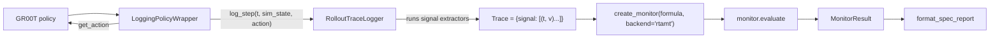

# rfm-validator — Architecture

> A contributor's map of the **rfm-validator** subproject that lives inside the NVIDIA Isaac GR00T
> N1.7 repository.

## 1. Overview & purpose

**rfm-validator** performs **goal-blind validation** of robot execution traces. Given a trace of what
a policy did and a **rulebook** of rules it should obey, it produces per-rule verdicts and an overall
pass/fail — *without* ever looking at the task, goal, reward, or success labels. The idea: judge
whether the observed *behavior* was compliant, not whether the robot happened to succeed.

Two kinds of rules are supported:

- **Formal rules** — deterministic monitors, including Signal Temporal Logic (STL). Example: "peak
  end-effector speed ≤ 0.8 m/s", "always keep ≥ 0.4 m from a human".
- **Informal rules** — natural-language behavioral rules judged by a **VLM-as-judge**. Example: "Robot
  motion should remain smooth and predictable."

> **Framing note.** This repo is primarily **Isaac GR00T N1.7** (a VLA model). rfm-validator is a
> *subproject layered on top*, living entirely under `src/`. The top-level `README.md` and `CLAUDE.md`
> are about GR00T and do not mention the validator — this document is the first architecture doc for
> it.

## 2. Package map

The subproject is three sibling packages under [`src/`](../src/). They are importable because pytest
sets `pythonpath = [".", "src", "tests"]` (see [Gotchas](#9-known-gaps--gotchas)).

| Package | Role |
| --- | --- |
| [`rfm_validator/`](../src/rfm_validator/) | High-level validation **pipeline** — loads traces + rulebooks, applies goal-blind sanitization, runs formal monitors and VLM judges, aggregates verdicts. |
| [`monitors/`](../src/monitors/) | Lower-level **STL monitoring** layer — `create_monitor(...)` factory over an RTAMT backend (plus a deprecated toy backend), the canonical safety `specs`, and trace validation. |
| [`groot_interface/`](../src/groot_interface/) | **GR00T rollout integration** — a logging policy wrapper and signal extractors that capture a policy rollout into a signal-dict trace the `monitors` layer consumes. |

### `rfm_validator/`
- [`types.py`](../src/rfm_validator/types.py) — shared dataclasses: `Observation`, `Action`,
  `ExecutionTrace`, `FormalRule`, `InformalRule`, `Rulebook`, `ValidatorVerdict`, `ValidationResult`.
- [`pipeline.py`](../src/rfm_validator/pipeline.py) — orchestration entry points `load_trace`,
  `run_validation`, `run_validation_from_paths`, plus `summarize_trace_for_vlm`.
- [`rulebook.py`](../src/rfm_validator/rulebook.py) — `load_rulebook` (YAML/JSON).
- [`goal_blind.py`](../src/rfm_validator/goal_blind.py) — `sanitize_trace_for_validation`, `EXCLUDED_KEYS`.
- [`formal_monitor.py`](../src/rfm_validator/formal_monitor.py) — `FormalMonitor` ABC,
  `SpeedLimitMonitor`, `STLMonitor`, `run_formal_monitors`.
- [`vlm/`](../src/rfm_validator/vlm/) — `VLMJudge` ABC, `MockVLMJudge`, `HuggingFaceVLMJudge`, and
  prompt build/parse helpers.
- [`backends/`](../src/rfm_validator/backends/) — `GrootBackend`, `HuggingFaceVLABackend` policy
  adapters (**stubs**, see gotchas).

### `monitors/`
- [`base.py`](../src/monitors/base.py) — `Trace`/`TimeSeries` type aliases, `MonitorResult` dataclass,
  `STLMonitor` Protocol.
- [`trace.py`](../src/monitors/trace.py) — `canonicalize_trace` / `validate_trace`.
- [`specs.py`](../src/monitors/specs.py) — `SAFE_DISTANCE`, `SPEED_LIMIT_NEAR_HUMAN`,
  `EVENTUALLY_OBJECT_LIFTED`, `NO_COLLISION`, and `SPEC_REGISTRY`.
- [`rtamt_monitor.py`](../src/monitors/rtamt_monitor.py) — `RTAMTMonitor`.
- [`toy_monitor.py`](../src/monitors/toy_monitor.py) — `ToySTLMonitor` (deprecated fallback).
- [`report.py`](../src/monitors/report.py) — `format_spec_report`.
- [`__init__.py`](../src/monitors/__init__.py) — `create_monitor(formula, *, variables=None, backend="rtamt")`.

### `groot_interface/`
- [`signal_extractors.py`](../src/groot_interface/signal_extractors.py) — `extract_end_effector_pose`,
  `extract_end_effector_speed`, `extract_distance_to_human`, `extract_collision_flag`,
  `extract_object_lifted`.
- [`action_plan_adapter.py`](../src/groot_interface/action_plan_adapter.py) — `action_to_signals`.
- [`rollout_logger.py`](../src/groot_interface/rollout_logger.py) — `RolloutTraceLogger`.
- [`policy_wrapper.py`](../src/groot_interface/policy_wrapper.py) — `LoggingPolicyWrapper`.

## 3. Two trace representations (read this first)

There are **two different, non-interchangeable trace shapes**. This is the single most common source
of confusion when contributing.

**A. `rfm_validator` `ExecutionTrace`** — a JSON-oriented, timestamped record of observations and
named actions ([`types.py`](../src/rfm_validator/types.py)):

```json
{
  "trace_id": "toy-trace-001",
  "metadata": { "episode_id": "ep-1", "task": "...", "goal": "...", "success": true },
  "observations": [ { "timestamp": 0.0, "data": { "speed": 0.2, "joint_load": 0.1 } } ],
  "actions":      [ { "timestamp": 0.1, "name": "move_arm", "parameters": { "delta": 0.05 } } ]
}
```

**B. `monitors` signal-dict `Trace`** — a map from signal name to a time series of `(t, value)` points
([`base.py`](../src/monitors/base.py)):

```python
Trace = dict[str, list[tuple[float, float]]]
# e.g. {"ee_speed": [(0.0, 0.2), (0.1, 0.7)], "dist_to_human": [(0.0, 0.9), ...]}
```

| | `ExecutionTrace` (A) | signal-dict `Trace` (B) |
| --- | --- | --- |
| Defined in | `rfm_validator/types.py` | `monitors/base.py` |
| Produced by | `pipeline.load_trace` (from JSON) | `groot_interface.RolloutTraceLogger` |
| Consumed by | `rfm_validator` pipeline + formal monitors | `monitors` STL monitors (`RTAMTMonitor`) |

The two validation paths below are only loosely connected today: the pipeline path uses (A); the
rollout→STL path uses (B). Bridging them (e.g. deriving an STL `Trace` from an `ExecutionTrace`) is
open work.

## 4. Data flow

### Flow 1 — the validation pipeline (`rfm_validator`)

Entry: `pipeline.run_validation` / `run_validation_from_paths`.

```
trace.json ──load_trace──▶ ExecutionTrace ─┐
                                           ├─▶ sanitize_trace_for_validation  (goal-blind)
rulebook.yaml ─load_rulebook─▶ Rulebook ───┘             │
                                                         ▼
                          ┌──────────────────────────────┴──────────────────────────────┐
                          ▼                                                               ▼
                 run_formal_monitors(formal_rules)                    summarize_trace_for_vlm ─▶ trace_summary
                    dispatch by rule_type                                     │
                  ┌──────────┴──────────┐                                     ▼
          SpeedLimitMonitor         STLMonitor                VLMJudge.judge(rule_id, rule_text, trace_summary)
                  │                       │                          per informal rule (default MockVLMJudge)
                  ▼                       ▼                                   │
             formal_verdicts[] ──────────────────────────┐   informal_verdicts[]
                                                          ▼            ▼
                                       overall_passed = all(v.passed for v in ...)
                                                          ▼
                                                  ValidationResult
```

Every rule — formal or informal — reduces to a `ValidatorVerdict(rule_id, passed, confidence,
rationale, metadata)`, and `overall_passed` is `all(...)` of them.

### Flow 2 — rollout capture → STL monitoring (`groot_interface` → `monitors`)



`LoggingPolicyWrapper` transparently proxies the wrapped policy (delegates `get_action`/`reset`,
`__getattr__`-forwards everything else) while staging the observation + action chunk. The rollout
runner calls `flush_steps(n)`, which synthesizes a continuous time axis (`t = step * dt`) and calls
`RolloutTraceLogger.log_step` per inner step; extractors turn each `(sim_state, action)` into scalar
signals. `finish_episode()` returns the accumulated `Trace`.

## 5. Core abstractions & extension points

- **`VLMJudge` (ABC)** — [`vlm/base.py`](../src/rfm_validator/vlm/base.py). Strategy interface for
  informal-rule judging (`is_available`, `load`, `judge(...)`). Pluggable via
  `run_validation(..., informal_validator=...)`.
  - `MockVLMJudge` — deterministic default; fails a rule whose text contains `unsafe`/`collision`/`abrupt`.
  - `HuggingFaceVLMJudge` — real text+image judge; lazily loads a `transformers`
    image-text-to-text model, prompts via `build_goal_blind_validation_prompt`, parses strict JSON via
    `parse_vlm_output_to_verdict`.
- **`FormalMonitor` (ABC)** — [`formal_monitor.py`](../src/rfm_validator/formal_monitor.py).
  `run_formal_monitors` dispatches by `rule_type`:
  - `speed_limit` → `SpeedLimitMonitor` (peak `speed` ≤ `max_speed`).
  - `stl` → `STLMonitor`, which reads a `safety_function` (source `observation`/`action`, `key`,
    `comparator`, `threshold`) and a `temporal_operator` (`always`→all, `eventually`→any). Engine is
    selected by `parameters["engine"]`: `builtin` (default), `rtamt` (STL robustness ≥ 0), or `argus`
    (**not integrated** — returns a failing verdict).
  - Unknown `rule_type` → failing "Unsupported formal monitor type" verdict.
- **`monitors.STLMonitor` Protocol + `create_monitor` factory** —
  [`monitors/__init__.py`](../src/monitors/__init__.py). `backend="rtamt"` → `RTAMTMonitor`,
  `"toy"` → `ToySTLMonitor`. Consumes signal-dict `Trace` (shape B). `RTAMTMonitor` builds an
  `rtamt.StlDiscreteTimeSpecification`, evaluates robustness, and reports `satisfied = robustness ≥ 0`.
- **Goal-blind contract** — enforced across *both* paths:
  `EXCLUDED_KEYS = {goal, goals, task, task_description, reward, success, success_label}` are stripped
  by `sanitize_trace_for_validation` from observation `data`, action `parameters`, and `metadata`; and
  the VLM prompt explicitly instructs the judge to ignore goals/rewards/success.
- **`backends/`** — `GrootBackend` (Isaac-GR00T submodule adapter) and `HuggingFaceVLABackend` are
  **forward-looking stubs** (`load`/`infer_action` are TODOs) and are not wired into the pipeline.

## 6. File formats

### Rulebook (YAML or JSON)

Loaded by `load_rulebook`; top-level keys `metadata`, `formal_rules`, `informal_rules`. Each list item
is splatted straight into a dataclass, so keys must match field names exactly.

```yaml
# examples/toy_rulebook.yaml
formal_rules:
  - rule_id: speed-001
    rule_type: speed_limit        # default; also "stl"
    description: End-effector speed must stay below 0.8 m/s.
    parameters:
      max_speed: 0.8
informal_rules:
  - rule_id: behavior-001
    text: Robot motion should remain smooth and predictable.
```

STL rule schema (see [`examples/toy_stl_rtamt_rulebook.yaml`](../examples/toy_stl_rtamt_rulebook.yaml)):

```yaml
formal_rules:
  - rule_id: stl-rtamt-speed-001
    rule_type: stl
    parameters:
      engine: rtamt               # "builtin" (default) | "rtamt" | "argus" (stub)
      temporal_operator: always   # always | eventually
      rtamt_variable: speed       # (rtamt engine) variable name in the spec
      rtamt_spec: always(speed <= 0.8)
      safety_function:            # builtin evaluator + signal extraction
        source: observation       # observation | action
        key: speed
        comparator: "<="
        threshold: 0.8
```

### Trace (JSON)

See [`examples/toy_trace.json`](../examples/toy_trace.json) and shape (A) in
[section 3](#3-two-trace-representations-read-this-first). Fields such as `metadata.task`,
`metadata.goal`, `metadata.success`, observation `data.reward`, and action
`parameters.task_description` are present in samples specifically to demonstrate that goal-blind
sanitization removes them.

## 7. How to run

There are **no console-script entry points**; invoke the example scripts directly.

```bash
# End-to-end pipeline on the toy trace + rulebook (formal + Mock VLM informal)
python examples/run_toy_validation.py

# Single informal rule judged by a real HF VLM (needs an image + model)
python examples/run_hf_vlm_validation.py --model-id google/gemma-3-4b-it --image-path <frame.png>

# STL monitoring layer standalone (monitors + RTAMT over a mock signal trace)
python examples/run_rtamt_on_groot_rollout.py
```

## 8. Testing

Validator tests are the top-level [`tests/test_*.py`](../tests/) files (the `tests/gr00t/`,
`tests/scripts/`, etc. subdirs belong to GR00T proper). All are CPU-safe; `rtamt` and `transformers`
are mocked so nothing is downloaded.

```bash
python -m pytest tests/test_formal_monitor.py tests/test_goal_blind.py \
  tests/test_policy_wrapper.py tests/test_vlm_prompting.py -v
```

| Test file | Covers |
| --- | --- |
| `test_rulebook.py` | `load_rulebook` parsing |
| `test_trace_format.py` | `canonicalize_trace` validation errors |
| `test_formal_monitor.py` | `SpeedLimitMonitor`, `STLMonitor` (builtin + rtamt + not-installed) |
| `test_rtamt_monitor_basic.py` | `RTAMTMonitor` pass/fail via fake `rtamt` |
| `test_goal_blind.py` | sanitization + summary do not leak goal/task/success |
| `test_vlm_prompting.py` | prompt content + output parsing / UNCERTAIN fallback |
| `test_vlm_validator.py` | `MockVLMJudge` verdict |
| `test_hf_vlm.py` | `HuggingFaceVLMJudge` with everything monkeypatched |
| `test_policy_wrapper.py` | `LoggingPolicyWrapper` proxying, timing, chunk flushing |
| `test_groot_adapter_mock.py` | `RolloutTraceLogger` + extractors → expected signal set |
| `test_backends.py` | `GrootBackend` submodule presence detection |

## 9. Known gaps & gotchas

- **Not installed as a package.** `[tool.setuptools.packages.find]` in
  [`pyproject.toml`](../pyproject.toml) includes only `gr00t*`, so the `src/` packages are **not** in
  the built wheel. They are importable only via pytest's `pythonpath = [".", "src", "tests"]`. Running
  the example scripts relies on the same `src/` being on `sys.path`.
- **Two trace shapes** (section 3) are not interchangeable; the pipeline path (A) and the STL/rollout
  path (B) are only loosely bridged.
- **Import-style inconsistency.** Top-level `rfm_validator` modules use relative imports (`.types`),
  while `vlm/`, `backends/`, and `groot_interface/` use absolute imports (`rfm_validator.types`,
  `monitors.base`).
- **Extractor signature mismatch.** `RolloutTraceLogger` expects
  `SignalExtractor = Callable[[Any, Any], float]`, but the concrete functions in
  `signal_extractors.py` / `action_plan_adapter.py` have different arities/returns (some take a `dt` or
  an `object_name`, some return dicts). They need adapters / `functools.partial` before use.
- **Missing re-exports.** `monitors/report.py`'s `format_spec_report` and
  `groot_interface`'s `LoggingPolicyWrapper` are not re-exported by their package `__init__.py`.
- **Stubs.** `backends/` (`GrootBackend`, `HuggingFaceVLABackend`) and the STL `argus` engine are
  unimplemented placeholders.
```
